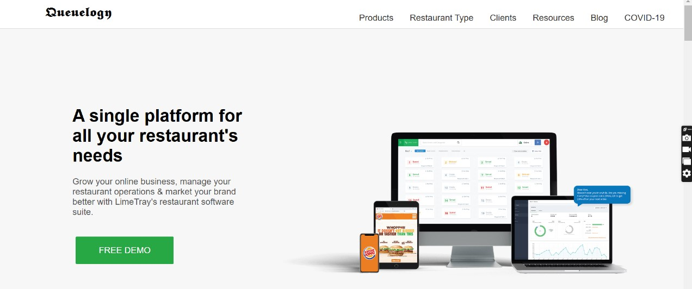
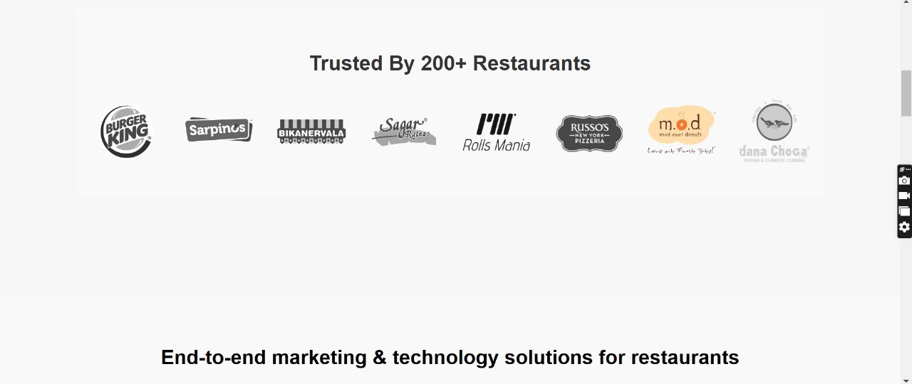
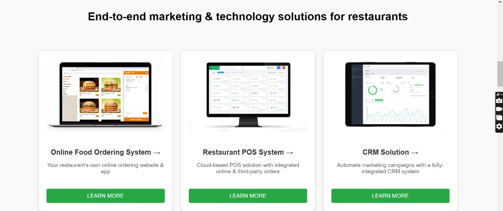
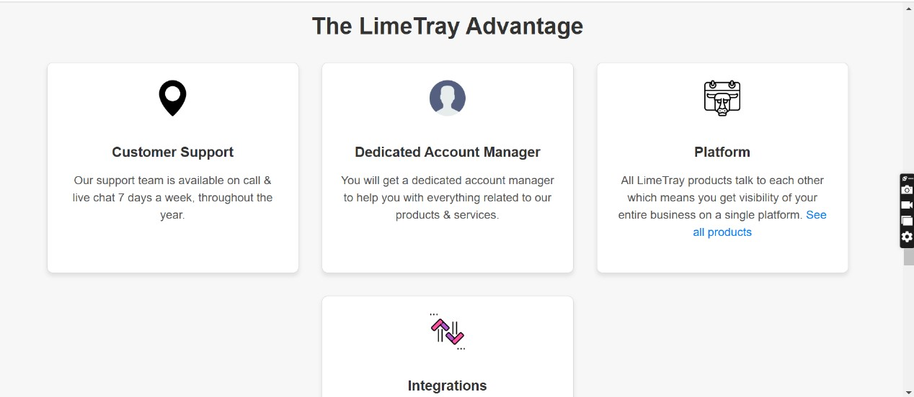
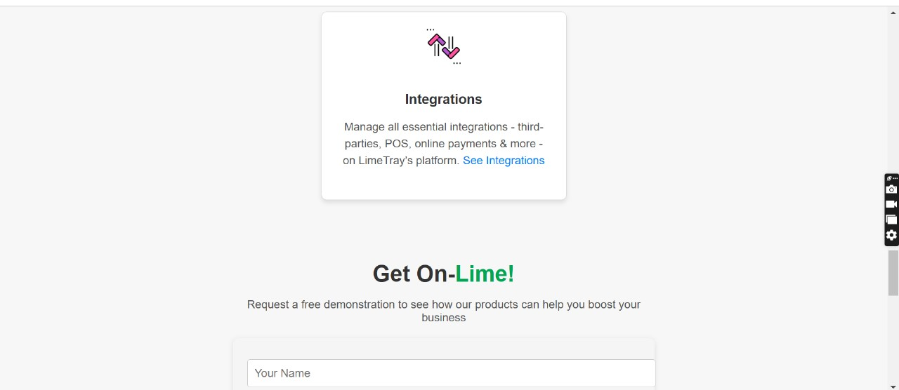
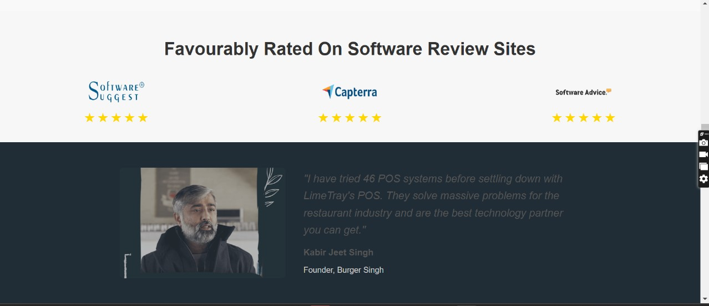
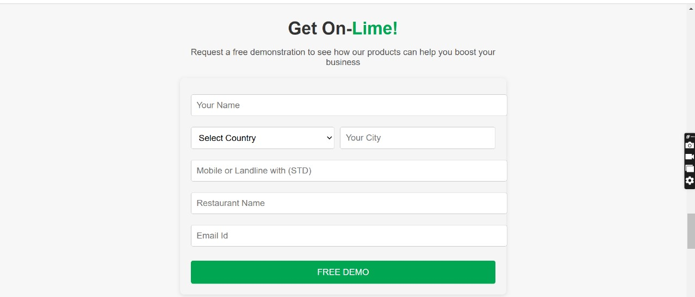
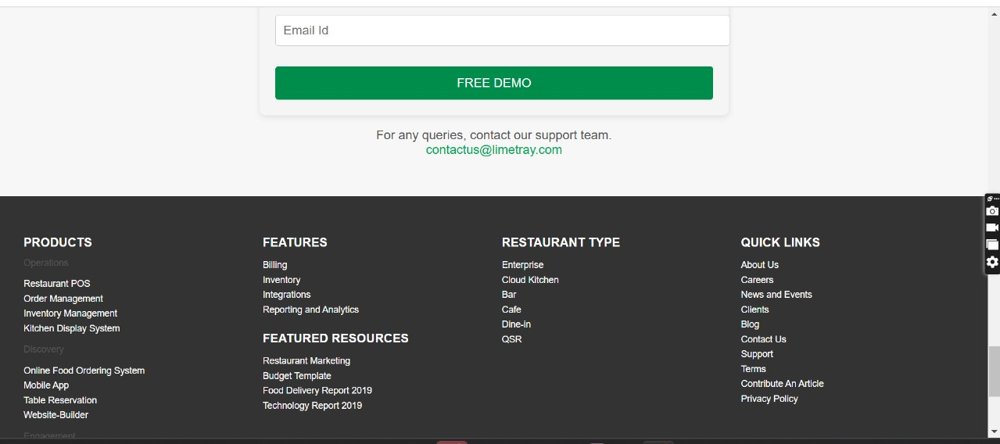

# 🍽️ Queuelogy – Restaurant Website Frontend

**Queuelogy** is a sleek, modern, and fully responsive restaurant website built using HTML, CSS, and JavaScript. Designed to deliver a premium user experience, it showcases a restaurant's offerings through engaging visuals, structured layout, and smooth scrolling. This project focuses on clean design principles, responsive layout techniques, and fundamental frontend development skills.

---

## 🌐 Live Demo

🚀 [Click here to view live](https://restraurent-web.vercel.app/)  

---

## 📸 Screenshots

### 

### 

### 

### 

### 

### 

### 

### 

---

## ✨ Features

- 🎯 Clean and structured homepage layout
- 🍲 Interactive menu display (starters, main course, desserts, beverages)
- 📱 Fully responsive across all devices (mobile, tablet, desktop)
- 🎨 Custom styling with elegant color scheme and fonts
- 💡 Scroll-to-section navigation
- 🖼️ Image-based sections for better visual engagement

---

## 🧰 Tech Stack

| Frontend | Styling | Tools |
|----------|---------|-------|
| HTML5    | CSS3    | VS Code |
| JavaScript /TypeScript | Flexbox & Grid | Git & GitHub |

---

